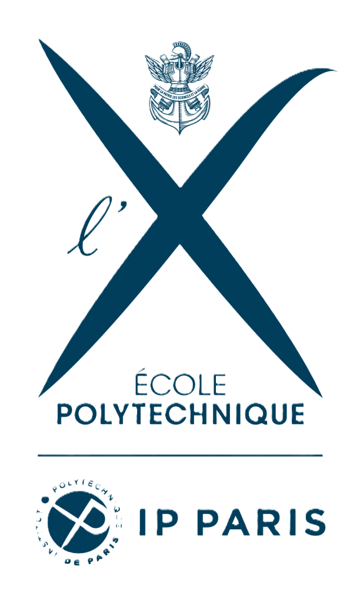
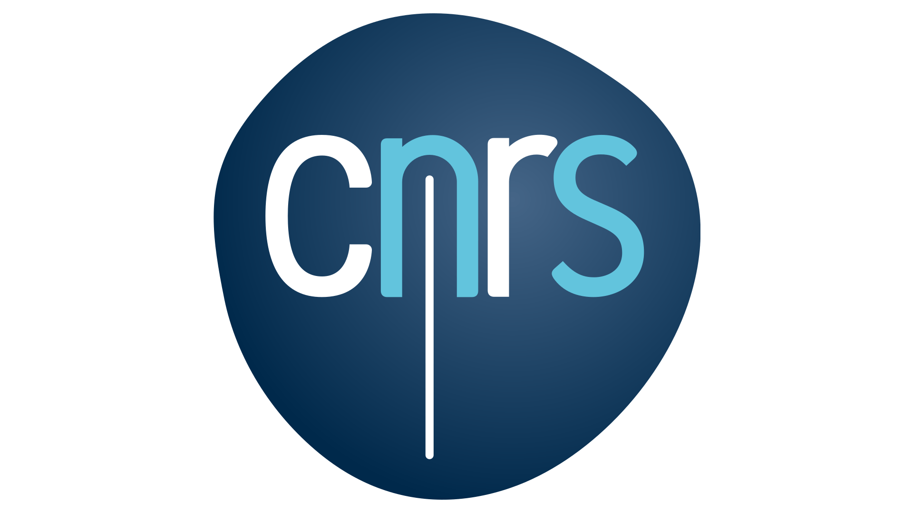
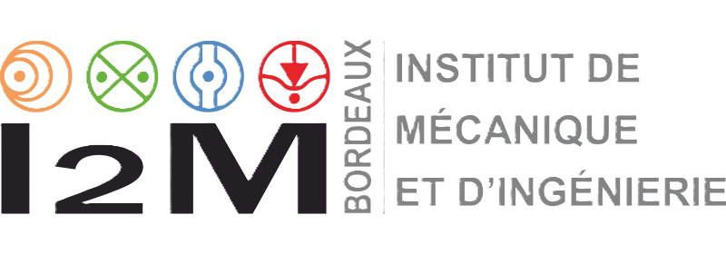
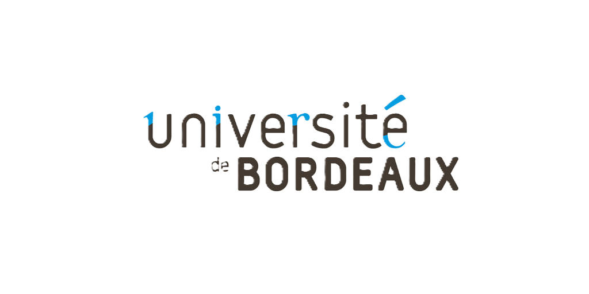
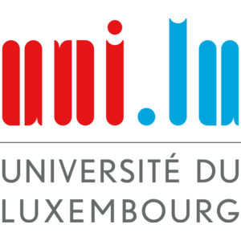
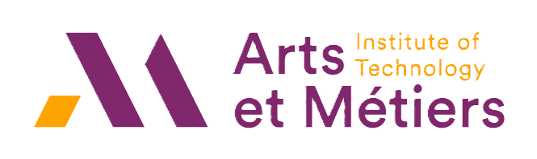
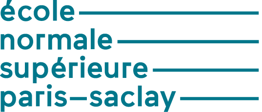
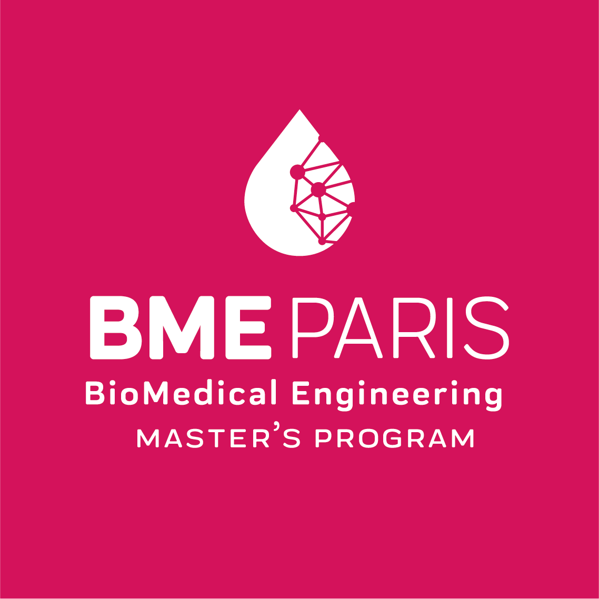

:::: {style='margin-top: 3em;'}
::::

##  &nbsp; Research Appointments

<!-- POSTDOC ROSALY -->

<h3>Post-Doctoral Researcher (ANR Rosaly)</h3>

12/2025 - 11/2027
Laboratoire de Mécanique des Solides, IP Paris, UMR 7649, CNRS

<strong>Supervisor:</strong> Jean-Marc Allain

Leading the poromechanical modelling and characterization of collagen hydrogels embedded with smooth muscle cells. The core work involves using experimental data to identify the material’s mechanical properties based on its fabrication conditions.

A key objective is the enhancement of poroelastic models (implemented in FEniCS) to incorporate the complex influence of contractile cells within the gel, specifically including their mechanoperception response. Further development will integrate microstructural information to accurately describe how collagen fibers move and reorient under mechanical load.

<!-- POSTDOC MATISSE -->

<h3>Post-Doctoral Researcher (ANR MATISSE)</h3>

09/2025 - 11/2025
Institut de mécanique et d'ingénierie (I2M), Univ. Bordeaux INP, UMR 5295, CNRS

<strong>Supervisor:</strong> Giuseppe Sciumè

Extended multi-compartment poromechanical models for biological soft tissues and porous liquids using the advanced finite element software FEniCSx.

In addition to leading simulations, I provided essential computational and numerical support to four PhD students to help them overcome technical hurdles. A key institutional responsibility involved the HPC installation of FEniCSx on the MCIA High-Performance Computing cluster, including the creation of comprehensive documentation.

:::: {style='margin-top: 4em;'}
::::

##  &nbsp; Education

<!-- PHD -->

<h3>Co-tutelle PhD in Engineering Sciences (Biomechanics)</h3>

09/2022 - 07/2025
 Université du Luxembourg & École Nationale Supérieure des Arts et Métiers (ENSAM) Paris

<strong>Funding:</strong> AFR-FNR Grant N°17013812

<strong>Thesis:</strong> <em>Biomechanical Response of Human Skin: A Hierarchical Porous Media Framework.</em> <a href="resources/documents/phd/Thomas_PhD_Manuscript_A4_Final.pdf" target="_blank" style="font-weight: bold;">[Read Manuscript]</a>

<ul>
<li>Awarded the <strong>2025 Excellent Thesis Award</strong> (University of Luxembourg), ranking among the best 10% of doctoral theses of the year.</li>
<li>Proposed for the <strong>Tarrach Prize</strong> (<a href="https://amis-uni.lu" target="_blank">Les Amis de l'Université du Luxembourg</a>) and the <strong>Prix Bézier</strong> (ENSAM).</li>
<li>Applicant for the FNR Outstanding PhD Thesis Award.</li>
</ul>

<!-- ARPE / PRE-DOC -->

<h3>Pre-Doctoral Research Year (ARPE)</h3>

09/2021 - 09/2022
École Normale Supérieure (ENS) Paris-Saclay & Legato Team (Univ. Luxembourg)

<strong>Supervisors:</strong> J. Lengiewicz, S. P-A. Bordas, A. Mazier, S. Deshpande

A one-year research fellowship focused on breast and soft tissue biomechanics: hyperelasticity, contact mechanics, micro-CT, image processing, and digital volume correlation. This successful placement laid the foundation for the subsequent co-tutelle PhD project.

<!-- ENSAM MASTER -->

<h3>Master of Science in Biomechanics (BME Paris)</h3>

2020 - 2021
École Nationale Supérieure des Arts et Métiers (ENSAM)

<strong>Supervisors:</strong> P-Y. Rohan, G. Sciumè, H. Pillet (at IBHGC, Paris)

<strong>Thesis:</strong> <em>Poromechanical modeling of muscle tissue to account for its apparent viscoelastic behaviour.</em>

<ul>
<li>Graduated with high honours, ranking <strong>4th out of 27 students</strong>.</li>
<li>Specialized in computational biomechanics, soft tissue mechanics, and advanced finite element modelling.</li>
</ul>

<!-- ENS BACHELOR / M1 -->

<h3>Master 1 & Bachelor's in Mechanical Engineering</h3>

2018 - 2020
École Normale Supérieure (ENS) Paris-Saclay

<ul>
<li><strong>Master 1 (Mechanical Sciences & Manufacturing):</strong> Ranked <strong>1st out of 18 students</strong>. Thesis focused on a numerical dummy for impact and concussion risk in rugby (IBHGC, Supervisors: S. Laporte, B. Sandoz).</li>
<li><strong>Bachelor's Degree (SAPHIRE):</strong> Received with high honours, ranking <strong>12th out of 70 students</strong>. Thesis focused on the Poynting Effect of 3D printed metal pantographs using in situ experiments and DVC (LMPS, Supervisor: F. Hild).</li>
</ul>

<!-- CPGE / HOCHE -->

<h3>Classes Préparatoires aux Grandes Écoles (PCSI/PSI*)</h3>

2016 - 2018
Lycée Hoche, Versailles

Intensive two-year academic program in advanced mathematics, physics, and engineering sciences. Rigorous preparation for the highly competitive national entrance exams to the French Grandes Écoles (leading to admission at ENS Paris-Saclay).

<em>Prior to this: General Baccalauréat in Engineering Sciences (High Honours) at Lycée Emilie de Breteuil (June 2016).</em>

