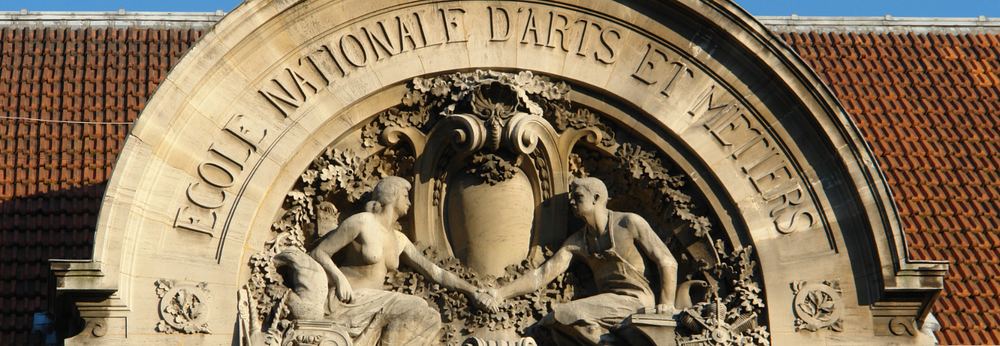
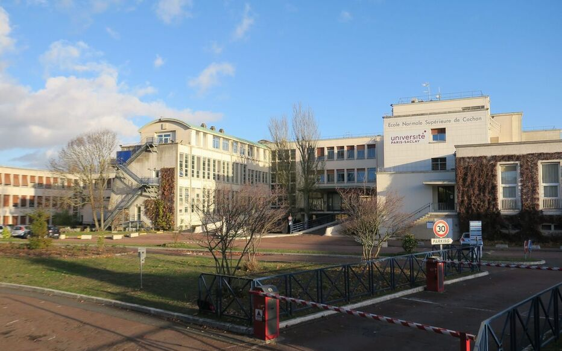
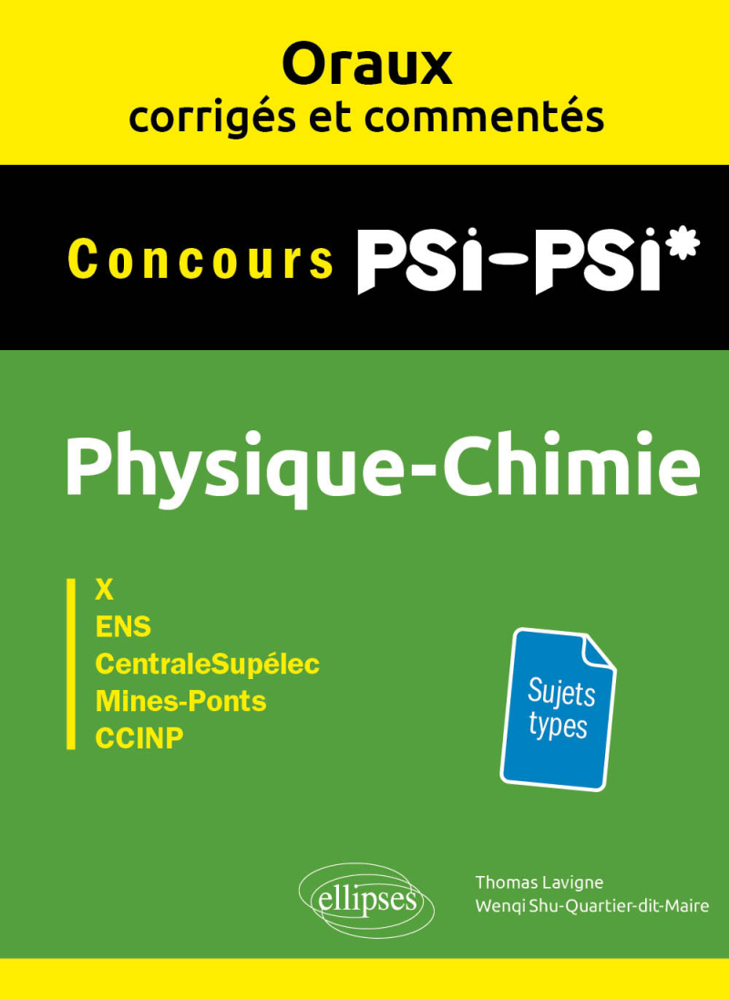
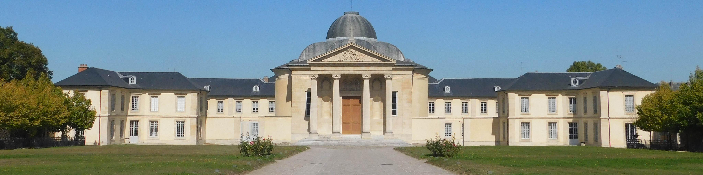

:::: {style='margin-top: 3em;'}
::::

##  &nbsp; Student Mentorship & Supervision

<h3>Research & Computational Mentorship</h3>
<h5>LMS (École Polytechnique) & I2M (Univ. Bordeaux) | 2024 - Present</h5>

I actively supervise and mentor junior researchers, focusing on computational modelling, poromechanics, experimental needs, and rigorous software engineering practices (Git, CI/CD testing, code review):

<ul class="supervision-list">
<li><strong>Matthieu Lacour (M2 & PhD - I2M):</strong> Co-supervised M2 internship on micro-fluidic chip design. Currently providing advanced computational mentoring for his PhD on Finite Element modelling using FEniCS.</li>
<li><strong>Gaspard Deremble (L3 - LMS):</strong> Supervising the computational modelling of the cornea, including advanced meshing methods and hyper-elastic material parameter gradients.</li>
<li><strong>Parsa Namazian (M1 - LMS):</strong> Supervising research on the poromechanics of hydrogels and cellular realignment during contraction.</li>
<li><strong>Laura Liquette (Contractual Researcher - I2M):</strong> Providing computational supervision and technical support for FEniCS-based Finite Element modelling.</li>
</ul>

:::: {style='margin-top: 3em;'}
::::

##  &nbsp; University Teaching

<!-- ENSAM CARD -->

<h3>Lecturer & Teaching Assistant</h3>
<h5>ENSAM Paris (BME Program & Apprentices) | 2022 - 2025</h5>

Delivered over 75 hours of teaching across L3, M1, and M2 university levels.

<ul>
<li><strong>L3:</strong> Mathematics</li>
<li><strong>M1:</strong> Basics in Solid Mechanics, Finite Element Modelling</li>
<li><strong>M2:</strong> Dynamics, Informatics, Experimental Methods</li>
</ul>

<!-- ENS CARD -->

<h3>Academic Tutor</h3>
<h5>École Normale Supérieure (ENS) Paris-Saclay | 2019 - 2020</h5>

Provided dedicated, tutored sessions for M1 students requiring additional academic support.

<ul>
<li><strong>Subjects covered:</strong> Physics, Mathematics, Mechanics, Practical Works, and Reporting methods.</li>
</ul>

:::: {style='margin-top: 3em;'}
::::

##  &nbsp; Preparatory Classes & Publications

<!-- PREP BOOK CARD -->

<h3>Textbook Co-Author</h3>
<h5>Éditions Ellipses | Physique-chimie PSI-PSI*</h5>

Co-authored the physics preparatory book <em>Oraux corrigés et commentés de Physique-Chimie PSI/PSI*</em> for undergraduate students (Classes Préparatoires aux Grandes Écoles).

The book provides physics problems, detailed corrections, and methodological comments to help students prepare for highly competitive entrance exams to prestigious French "Grandes Écoles" (X, ENS, CentraleSupélec, Mines-Ponts).

<a href="https://www.editions-ellipses.fr/accueil/16845-31310-oraux-corriges-et-commentes-de-physique-chimie-psi-2e-edition-9782340111981.html#/1-format_disponible-broche" target="_blank" class="btn btn-outline-primary rounded-pill btn-sm mt-2">View Book &nbsp; </a>

<!-- HOCHE CARD -->

<h3>Oral Examiner (Khôlleur)</h3>
<h5>Lycée Hoche, Versailles | 2018 - 2020</h5>

Conducted weekly oral examinations in Physics, Chemistry, and Engineering Sciences for classes préparatoires students. Evaluated and guided students preparing for competitive national engineering entrance exams.

:::: {style='margin-top: 3em;'}
::::

##  &nbsp; Advanced Computational Courses

<h3>FEniCSx & GMSH Open-Source Tutorials</h3>
<h5>Available Online (v0.9.0) | (v0.10.0 in progress)</h5>

Designed comprehensive open-source Jupyter notebooks and tutorials teaching the use of <strong>FEniCSx</strong> and <strong>GMSH</strong> for finite element modelling. The course covers local installation, Docker deployment, and using Spack for High-Performance Computing (HPC) environments.

<a href="https://th0maslavigne.github.io/FEniCSx_GMSH_tutorials/README.html" target="_blank" class="btn btn-outline-primary rounded-pill btn-sm"> Tutorial Website</a>
<a href="https://github.com/Th0masLavigne/FEniCSx_GMSH_tutorials.git" target="_blank" class="btn btn-outline-primary rounded-pill btn-sm"> GitHub Repository</a>

