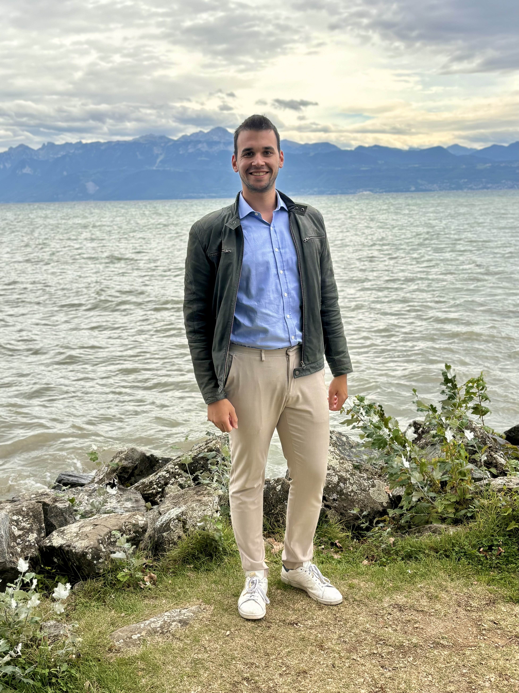
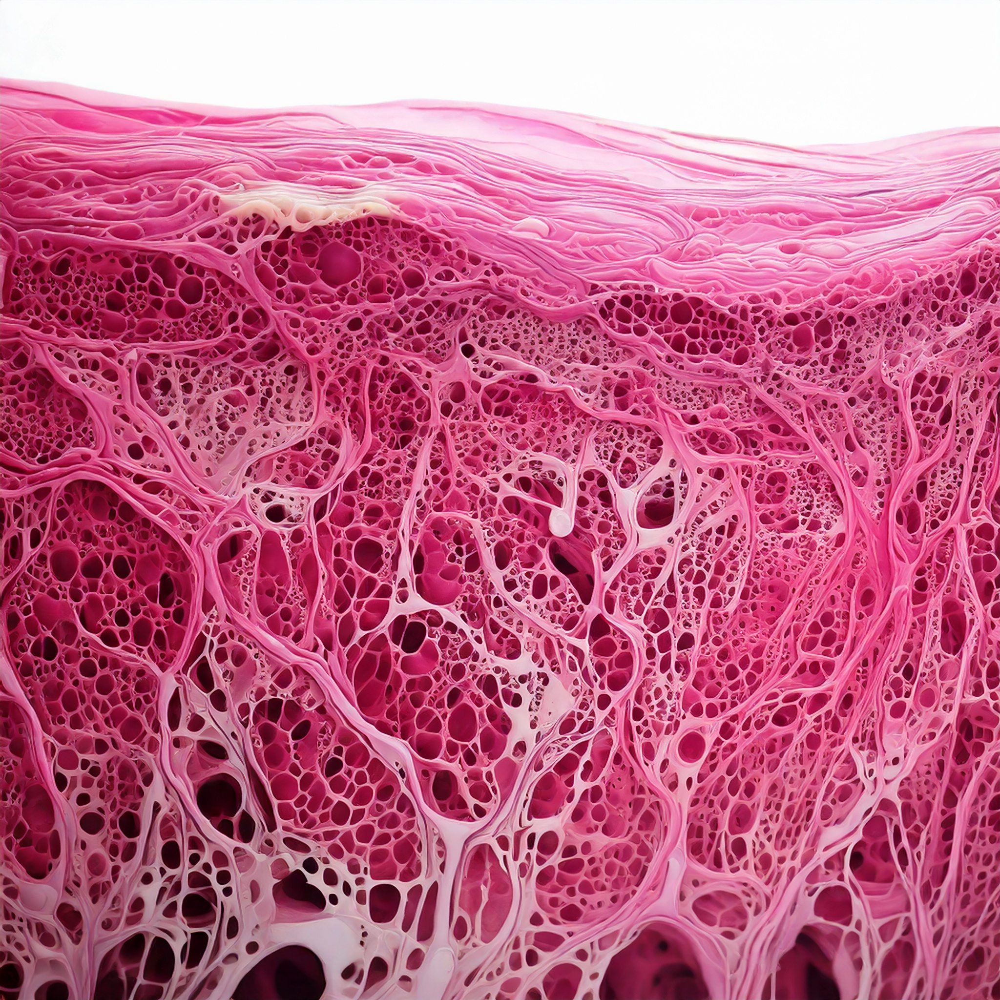
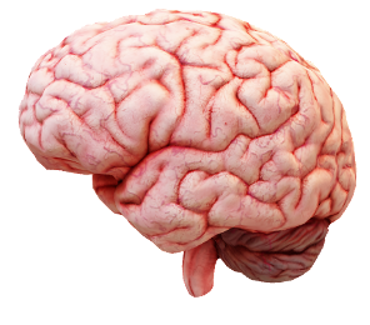
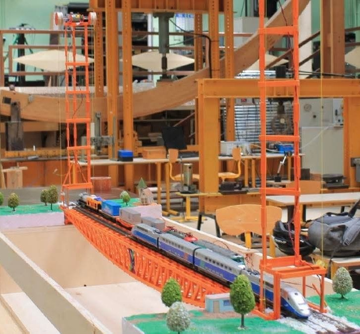

:::::{.main-sheet}

<!-- HERO SECTION -->
:::{.hero-container}

<h1>Thomas Lavigne</h1>

  Researcher in Biomechanics & Computational Modeling, specializing in poromechanics and multiscale modeling of soft biological tissues.

  <a href="https://orcid.org/0000-0003-2690-3542" class="btn btn-outline-primary rounded-pill" target="_blank"> Orcid</a>
  <a href="https://scholar.google.com/citations?user=FYXQf_UAAAA" class="btn btn-outline-primary rounded-pill" target="_blank"> Scholar</a>
  <a href="https://www.researchgate.net/profile/Thomas-Lavigne-2" class="btn btn-outline-primary rounded-pill" target="_blank"> ResearchGate</a>
  <a href="https://github.com/Th0masLavigne" class="btn btn-outline-primary rounded-pill" target="_blank"> GitHub</a>
  <a href="mailto:thomas.lavigne@polytechnique.edu" class="btn btn-outline-primary rounded-pill"> Email</a>

:::

---

  <strong>Welcome!</strong> My research focuses on characterizing the complex time-dependent mechanical behavior of soft biological tissues like human skin and skeletal muscle. I utilize advanced numerical simulation alongside theoretical developments and experiments to create models with direct applications in fields such as pressure ulcer prevention and tissue engineering.

::: {.info-card}
### 🔬 Current & Recent Research
*   **CNRS ANR Rosaly Post-Doctoral Researcher (12/2025–2027):** A two-year project focused on the **mechanical characterization of hydrogels embeded with smooth muscle cells**, intended for use in understanding aneurysms at the [Laboratoire de Mécanique des Solides (LMS)](https://lms.ip-paris.fr/personnel/doctorants-post-doctorants), Polytechnique.
*   **Post-Doctoral Position (09/2025–11/2025):** A three-month appointment at [I2M Bordeaux](https://www.bdx-poromechanics.com/involved-persons.html), dedicated to **multiscale modeling, HPC software deployment, and porous fluids**.
:::

::: {.info-card .card-right}
### 🎓 The PhD Journey
Former student of the **École Normale Supérieure (ENS) Paris-Saclay** (Mechanical Engineering), I recently earned a **Dual Doctoral Degree** (*Docteur en Sciences de l'Ingénieur*) through a **Co-tutelle PhD (2022-2025)** that was funded by an AFR grant of the Luxembourg Fond National de la Recherche (FNR). A French grant (CDSN) was also obtained for this work but was abandonned for the AFR FNR. 

My thesis, *Biomechanical modelling of human skin: a hierarchical porous media framework*, successfully coupled mechanics and biology (microvascular response) to provide insights into the time-dependent, ischemic, and hyperemic responses of human skin to an external load. 

**Joint Effort:** Université du Luxembourg & ENSAM Paris. 
*Awarded the **2025 Excellent Thesis Award** (Uni.lu) and proposed for the Rolf Tarrach Prize (Les amis du Luxembourg), the Outstanding PhD Award (FNR) and the Prix Bézier (ENSAM).*

<!-- Using your native 'button' class defined in style_site.scss! -->

  <a href="resources/documents/phd/Thomas_PhD_Manuscript_A4_Final.pdf" target="_blank" class="btn btn-outline-primary rounded-pill"> Full Manuscript</a>
  <a href="resources/documents/phd/main_VF.pdf" target="_blank" class="btn btn-outline-primary rounded-pill"> Defense Slides</a>
  <a href="resources/documents/phd/summary_thesis_lavigne.pdf" target="_blank" class="btn btn-outline-primary rounded-pill"> Lay Abstract</a>
  <a href="resources/documents/phd/Lavigne_tarrach_template_ppt_split.pdf" target="_blank" class="btn btn-outline-primary rounded-pill"> Lay Slides</a>

:::

  <h3 style="margin: 0;">🌍 International Research Footprint</h3>
  <button onclick="resetMap()" class="btn btn-outline-primary rounded-pill btn-sm">
    <iconify-icon icon="fa6-solid:arrows-rotate"></iconify-icon> Reset View
  </button>

  ● Research Labs & Education | ● Conferences & Symposiums

::: {.info-card}
### 🤝 Collaborations & Mentoring
I am deeply dedicated to open science and committed to sharing knowledge and fostering new research. I actively participate in **student mentoring**, guiding interns and junior researchers in computational mechanics and biomechanics.

As part of the [Legato Team](https://sites.google.com/view/legato-team/team/luxembourg-team/thomas-lavigne), the [IBHGC](https://biomecanique.ensam.eu/accueil-biomeca-100770.kjsp), and the [I2M Porous Modelling team](https://www.bdx-poromechanics.com/involved-persons.html), I designed and maintain tutorials to help researchers master tools like **Git** and **FEniCSx**. 

I also collaborate on multidisciplinary studies, including:

*   Breast chemotherapy modeling (Univ. of Leeds)
*   Brain growth & porous modeling (IMT Atlantique / Univ. of Luxembourg)
*   Microfluidic chip design (Univ. de Bordeaux)

**I am always open to new collaborations and student mentoring opportunities.** Feel free to [contact me via email](mailto:thomas.lavigne@polytechnique.edu)!
:::

You can learn more about my detailed academic background in my [Academic CV](resources/documents/cv/thomas_lavigne_cv_2.pdf).

<!-- CAROUSEL SECTION -->
:::{.carousel style="margin-top: 3rem;"}

  
  
<strong>PhD Graphical Abstract</strong> Coupling biology and mechanics in Human skin.

  
  
<strong>Human Skin as a Porous Network.</strong>

  
  
<strong>Brain Biomechanics</strong> Modeling cortical folding and oncology.

  
  
<strong>Building a Bridge with ice sticks</strong> Design (theoretical, experimental, numerical) of an ice stick bridge (ENS 2018-2019).

:::

  &#10094;
  &#10095;

:::::