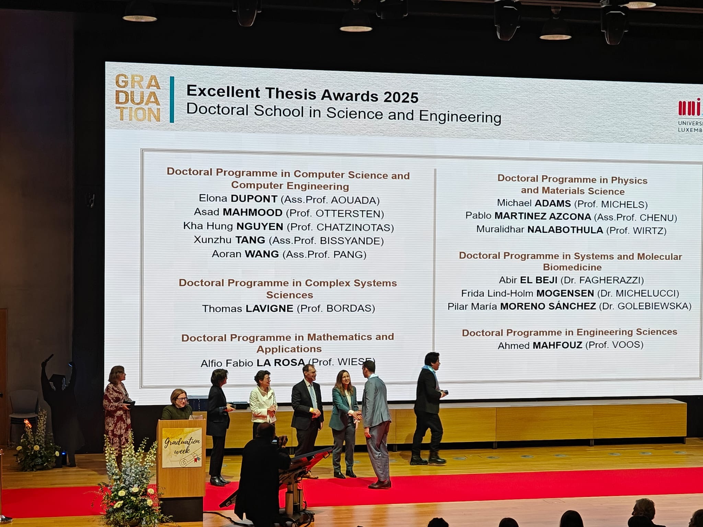
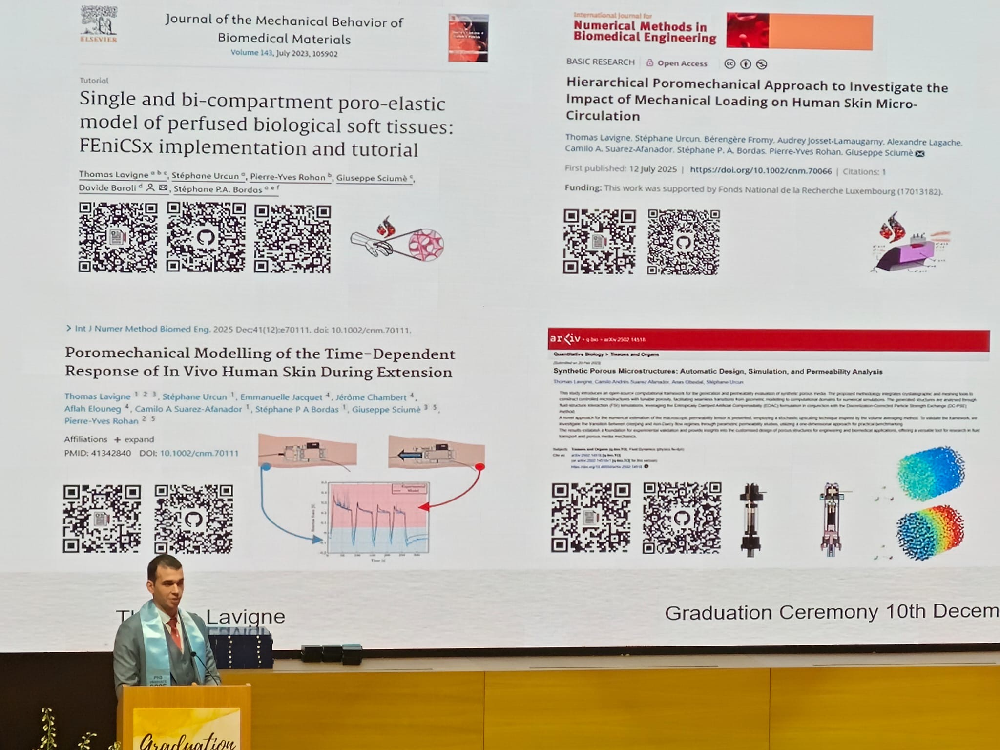

On December 10, 2025, I reached a major milestone at the University of Luxembourg’s PhD Graduation ceremony, where I officially received my doctoral diploma. 

I am incredibly honored to announce that I was also the recipient of an Excellent Thesis Award (ETA) from the University of Luxembourg. It was a privilege to be called on stage to accept this prize and celebrate alongside friends and colleagues in the presence of the Rector, Vice-Rector, and the Minister of Higher Education. I was also grateful for the opportunity to present a portion of my research to the audience.

None of this would have been possible without the support of many incredible people. A heartfelt thank you to:
- My Funding: The FNR (Grant AFR-FNR 17013812) for believing in this project.
- My Mentors: My supervisors for their guidance.
- My Network: My colleagues, friends, and family for their unwavering support.
- The Unsung Heroes: The admin support, IT teams, HR, and doctoral schools who work behind the scenes to make projects like this come to life.
- The Volunteers: Thank you for making the ceremony such a memorable event.

You can watch the recording of the ceremony here: (https://www.youtube.com/live/2Aq1HwV_Lv8)

{width="75%" fig-align="center"}
{width="75%" fig-align="center"}
{width="75%" fig-align="center"}

As part of a cotutelle program, I look forward to receiving my second diploma from ENSAM later this year.

\#Gradutation \#PhD \#Award \#UniLu