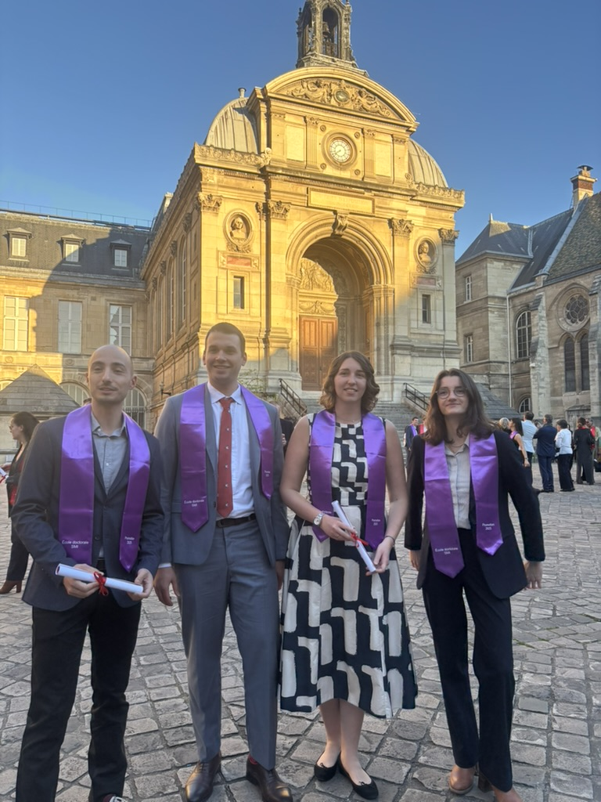

Following my graduation in Luxembourg last December, I was honored to attend my second ceremony with my friends also graduated past year—this time in France.

Receiving my French doctoral diploma officially marks the conclusion of my cotutelle journey between the University of Luxembourg and Arts et Métiers (ENSAM Paris), in collaboration with I2M Bordeaux.

Navigating a joint PhD across borders was a challenging but incredibly rewarding experience. It allowed me to bridge two academic cultures and work alongside brilliant minds in both countries. I am deeply grateful to my French supervisors and colleagues for their warm welcome, mentorship, and support throughout these years.

This ceremony was the perfect way to celebrate the "French side" of my research on the biomechanics of human skin. A huge thank you to everyone who made yesterday so memorable!

\#PhD #Graduation \#Cotutelle \#France \#Luxembourg \#Biomechanics \#ArtsEtMetiers \#ResearchLife \#DualDegree

{width="75%" fig-align="center"}