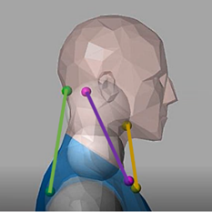
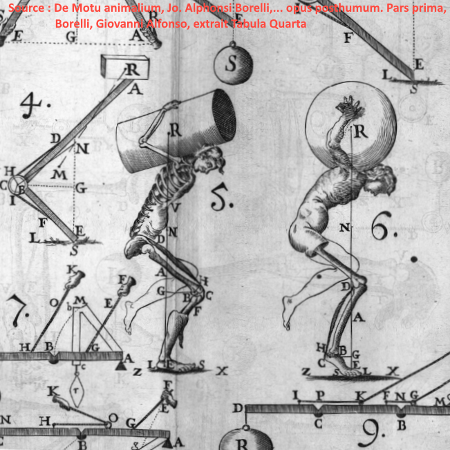

:::: {style='margin-top: 3em;'}
::::

##  &nbsp; Publications

<!-- THE INTERACTIVE FOLDER UI -->

<button class="pub-back-btn" onclick="closeDetailView()"> &nbsp; Back to Grid</button>

<h3 id="detail-title" class="pub-detail-title"></h3>

<strong>Authors:</strong> 

DOI: 

<strong>Keywords:</strong> <i id="detail-keywords"></i>

<h4 style="margin-top: 25px; color: var(--text-main);">Abstract</h4>

##  &nbsp; Work in Progress

  I am currently actively developing several exciting research avenues that are in preparation for submission and publication:

<!-- WIP Card 1 -->

<h5 style="color: var(--text-main, #031C59); font-weight: 700; margin-top: 0; display: flex; align-items: center; gap: 10px;">
<iconify-icon icon="fa6-solid:brain"></iconify-icon> Brain Mechanics
</h5>

<strong>Cortical Folding & DVC:</strong> Quantifying brain tissue strain and simulating fetal cortical folding using advanced Digital Volume Correlation (DVC) and complex contact mechanics.

<!-- WIP Card 2 -->

<h5 style="color: var(--text-main, #031C59); font-weight: 700; margin-top: 0; display: flex; align-items: center; gap: 10px;">
<iconify-icon icon="fa6-solid:dna"></iconify-icon> Cellular Hydrogels
</h5>

<strong>Force & Remodeling:</strong> Investigating the active mechanics of smooth muscle cells, specifically focusing on how they exert force and dynamically remodel their surrounding collagen network.

<!-- WIP Card 3 -->

<h5 style="color: var(--text-main, #031C59); font-weight: 700; margin-top: 0; display: flex; align-items: center; gap: 10px;">
<iconify-icon icon="fa6-solid:water"></iconify-icon> Porous Liquids
</h5>

<strong>Viscous Matrices:</strong> Developing and implementing novel computational frameworks to model poromechanical systems where the "matrix" itself behaves as a highly viscous fluid.

##  &nbsp; Public outreach

:::: {style='margin-top: 2em;'}
::::

###  Dissemination PhD Slides

You can find here work in progress for dissemination of my PhD research to a broader public.

**Ajouter ici le résumé de thèse et la présentation Tarrach**

  <a href="resources/documents/phd/Lavigne_tarrach_template_ppt_split.pdf" target="_blank" class="btn btn-outline-primary rounded-pill"> Slides</a>
  <a href="resources/documents/phd/summary_thesis_lavigne.pdf" target="_blank" class="btn btn-outline-primary rounded-pill"> Lay Summary</a>

###  Articles in Eduscol [French]

<!-- EDUSCOL CARD 1 -->

<h4>Caractérisation mécanique d'un tissu mou : le muscle passif</h4>

This resource aims to present the scientific approach in biomechanics for modeling a soft tissue, namely muscle, at the macroscopic scale subjected to external loading (tension/compression). It was designed to complement the resource "Introduction to Biomechanics," which covers several important points of this discipline. The present resource is based on research work conducted during the authors' master's degree in biomechanics.

<a href="https://sti.eduscol.education.fr/si-ens-paris-saclay/ressources_pedagogiques/caracterisation-mecanique-dun-tissu-mou-le-muscle-passif" target="_blank" class="btn btn-outline-primary rounded-pill btn-sm">Read on Eduscol &nbsp; </a>

<!-- EDUSCOL CARD 2 -->

<h4>Introduction à la Biomécanique</h4>

Biomechanics, in its commonly accepted definition, consists of applying the tools, methods, and principles of mechanics to biological tissues and organs and their associated medical problems. It is an ancient discipline, studied since antiquity, but it became established as a distinct field in its own right during the 1960s and 1970s. This resource aims to present the main challenges, their associated analyses and measurement tools, and their clinical applications.

<a href="https://sti.eduscol.education.fr/si-ens-paris-saclay/ressources_pedagogiques/introduction-a-la-biomecanique" target="_blank" class="btn btn-outline-primary rounded-pill btn-sm">Read on Eduscol &nbsp; </a>

##  &nbsp; Reviewing Tasks

Participated in reviews for the *Journal of Biomechanics* and *Applied Mathematical Modelling*.

<!-- =======================================================
     THE DATA FETCHER AND LOGIC FOR THE PUBLICATION APP
     ======================================================= -->
